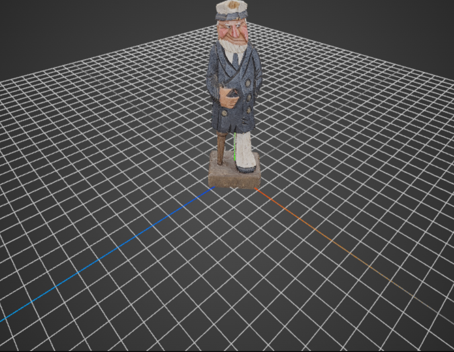
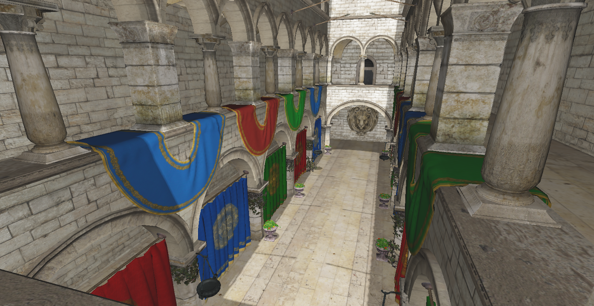
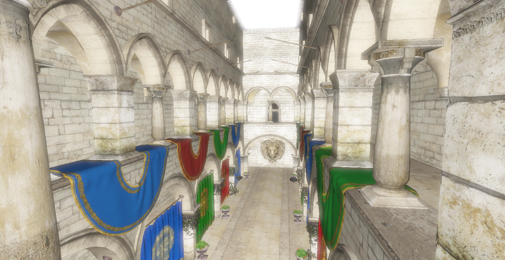
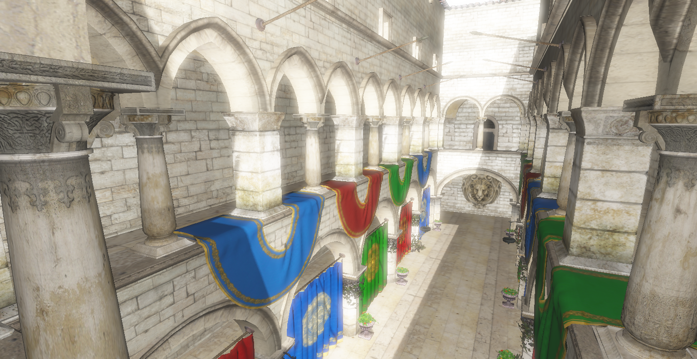
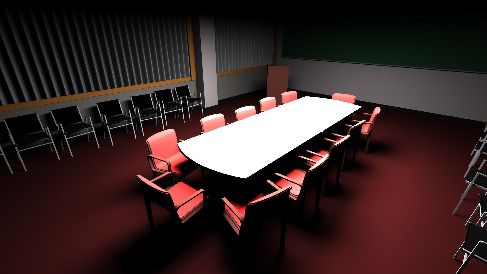
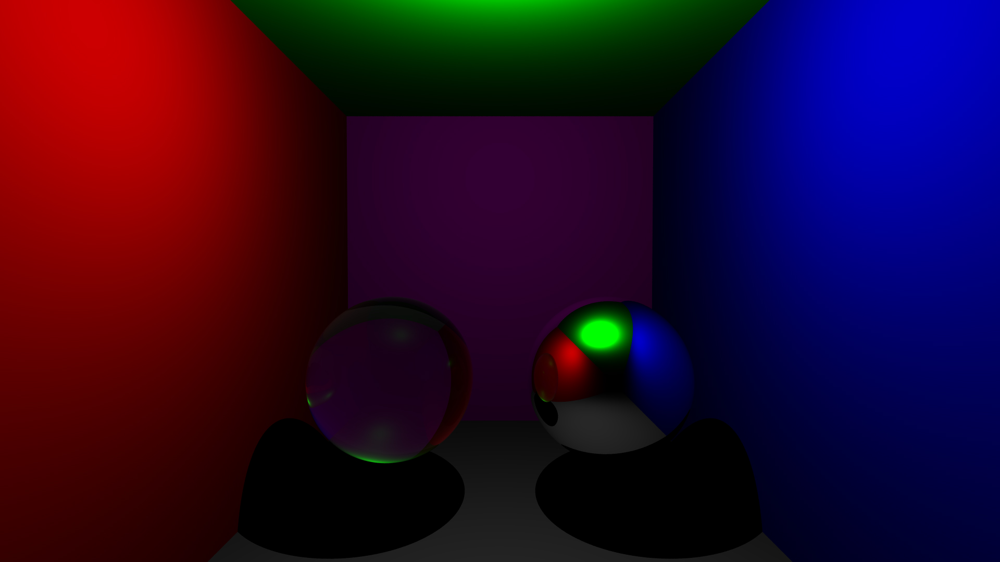
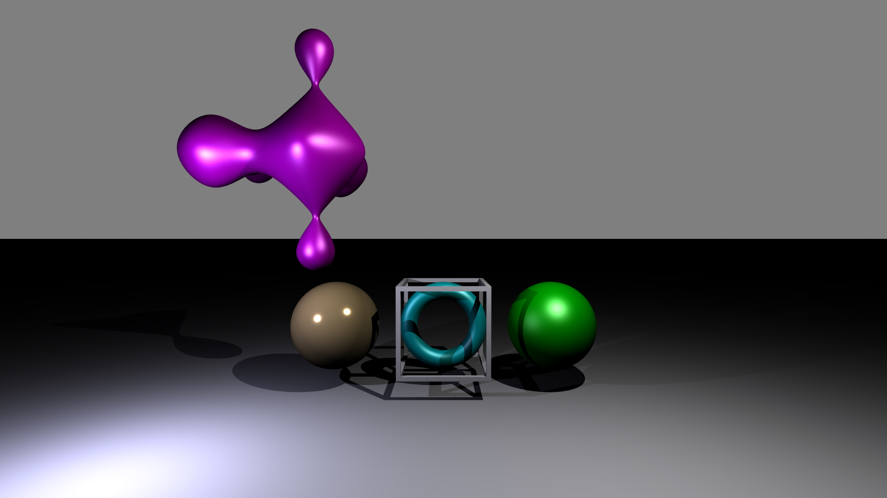
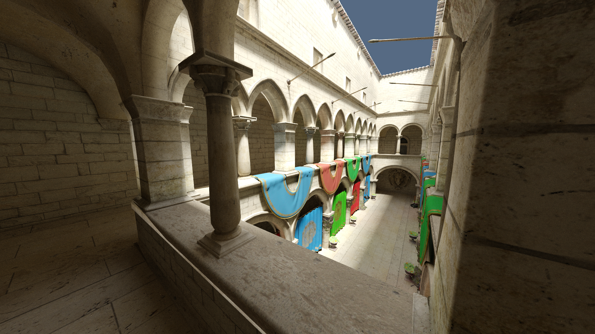
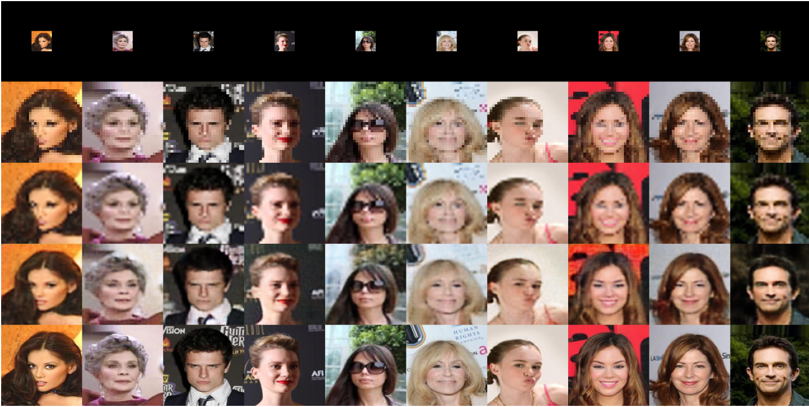

**Étudiant en master 2 [Informatique, Synthèse d'Images et Conception Graphique (ISICG)](https://www.sciences.unilim.fr/informatique/master-informatique-isicg/)**  
*Université de Limoges*

Intéressé par le **rendu PBR (Physically Based Rendering)**, la **simulation physique** et le **calcul accéléré sur GPU**.

 

---
### 💻 Stack Technique
     
     
 

 

# 🛠️ Projets

## 🌊 Simulation de fluides accélérée par GPU
**Stage R&D, laboratoire XLIM, Limoges**

Développement d'une simulation de fluides basée sur la méthode de Boltzmann (LBM), avec accélération GPU via CUDA. Le système prend en charge la simulation monophasique (1 fluide) puis diphasique (eau et air), modélisant la formation et la remontée de bulles d'air en 2D, avant une extension en 3D.

**Technologies :** 
     

### 1. Première phase : validation CPU vs GPU (1 fluide)
Implémentation initiale en Python pour valider la méthode LBM avant la parallélisation sur GPU. La simulation est visualisée avec OpenGL, en utilisant le cas test du vortex de von Kármán pour observer le comportement du fluide.

<table align="center" width="100%">
<tr>
<td align="center" width="50%">
<b>Implémentation Initiale (Python CPU)</b>  
<video src="https://github.com/user-attachments/assets/f975a769-a7b0-4f14-ab77-7f287e923454" controls width="100%"></video>
 <em>Résolution : 100 × 50 | ~143 ms/frame (~7 FPS) </em>
</td>
<td align="center" width="50%">
<b>Implémentation Optimisée (CUDA GPU)</b>  
<video src="https://github.com/user-attachments/assets/0f347854-f7cf-4039-b175-759d79996c81" controls width="100%"></video>
 <em>Résolution : 1200 × 800 | ~10 ms/frame (~100 FPS) </em>
</td>
</tr>
</table>

### 2. Deuxième phase : simulation diphasique (eau/air)
Extension du modèle pour simuler l'interaction entre deux fluides et la dynamique des bulles. Sur CPU, l'identification des composantes connexes (bulles) reposait sur un algorithme séquentiel itératif de type Union-Find sur grille. La parallélisation de cette réduction de graphe constituant un goulot d'étranglement, le calcul a été déporté sur GPU en intégrant l'algorithme optimisé CCL HA4 de NVIDIA, permettant un suivi précis en temps réel.

<table align="center" width="100%">
<tr>
<td align="center" width="50%">
<video src="https://github.com/user-attachments/assets/7afd0810-3702-48fb-98c2-70f209794d57" controls width="100%"></video>
 <em>Simulation des fluides dans une structure poreuse 2D (céramique).</em>
</td>
<td align="center" width="50%">
<video src="https://github.com/user-attachments/assets/38f8e28f-ce1e-4e03-ac72-46dac5202c3d" controls width="100%"></video>
 <em>Simulation diphasique d'un robinet illustrant la formation de bulles.</em>
</td>
</tr>
</table>

### 3. Simulation 3D et rendu volumétrique
Extension de la simulation en 3D (C++ et CUDA) avec intégration de la bibliothèque OpenVDB pour le traitement des géométries. Le rendu est fait par un compute shader GLSL exécutant un algorithme de ray marching volumétrique. Le shader évalue les normales par calcul de gradient sur la grille et modélise physiquement les interfaces eau/air (équations de Fresnel, réflexion, réfraction, absorption).

<table align="center" width="100%">
<tr>
<td align="center" width="50%">
<video src="https://github.com/user-attachments/assets/dbf55cb2-b622-4211-aec1-3ac2d258b711
" controls width="100%"></video>
 <em>Visualisation 3D de la dynamique du fluide par nuage de points.</em>
</td>
<td align="center" width="50%">
<video src="https://github.com/user-attachments/assets/32d4fcb3-a1f2-4b3c-af54-099c1f9645d9" controls width="100%"></video>
 <em>Rendu de l'eau via ray marching volumétrique. </em>
</td>
</tr>
</table>

## Reconstruction 3D par photogrammétrie
Reconstruction 3D d'objets réels par photogrammétie et synthèse d'images par rendu inverse.
 
**Technologies :** 
   
 
**[Consulter le projet complet et le visualiseur 3D interactif](https://harounjilani.github.io/Quarto/)**

<table align="center" width="50%">
<tr>
<td align="center" width="50%">

 <em>Modèle 3D reconstruit et visualisé.</em>
</td>
</tr>
</table>

## ⚙️ Moteur de rendu temps réel (OpenGL)

Développement d'un moteur 3D en C++ et OpenGL reposant sur une architecture de rendu différé (deferred shading). Le pipeline graphique intègre la génération de G-Buffers via Multiple Render Targets (MRT) et l'application d'effets de post-traitement en espace écran.

**Fonctionnalités implémentées :**
*   **Shadow mapping :** calcul d'ombres portées directionnelles avec application d'un biais adaptatif et d'un filtrage PCF pour adoucir les contours.

*   **Bloom :** extraction des hautes lumières via un seuillage progressif pour éviter les artefacts, suivie d'un filtrage séparable pour diffuser l'effet lumineux.
*   **Post-processing :** application d'un algorithme de tone mapping et d'une correction gamma pour la conversion de l'image HDR en espace sRGB.

**Technologies :** 
  

<table align="center" width="100%">
  <tr>
    <td align="center" width="50%">
      
       <em>Shadow mapping uniquement.</em>
    </td>
    <td align="center" width="50%">
      
       <em>Bloom uniquement.</em>
    </td>
  </tr>
  <tr>
    <td align="center" colspan="2">
       
      
       <em>Shadow mapping + bloom + tone mapping + correction gamma.</em>
    </td>
  </tr>
</table>

## 💡 Moteur de ray tracing
Développement d'un moteur de ray tracing en C++, étendu par la suite en un path tracer pour la simulation de l'illumination globale.

**Fonctionnalités implémentées :**
*   **Ray Tracing :** lancer de rayons classique gérant les ombres portées, ainsi que les matériaux transparents et miroirs.
*   **Path Tracing :** calcul de l'illumination globale basé sur la méthode de Monte-Carlo.
*   **Matériaux PBR :** gestion de la couleur, rugosité et métallicité avec le modèle de micro-facettes (Cook-Torrance/GGX).
*   **Structure d'accélération :** optimisation des performances via une structure de données BVH accélérée par l'heuristique SAH.
*   **Surfaces implicites :** Implémentation de l'algorithme de sphere tracing pour le rendu de géométries implicites.

**Technologies :** 

<table align="center" width="100%">
  <tr>
    <td align="center" width="33.33%">
      
       <em>Scène Conference (maillage).</em>
    </td>
    <td align="center" width="33.33%">
      
       <em>Matériaux transparents et miroirs.</em>
    </td>
    <td align="center" width="33.33%">
      
       <em>Rendu par sphere tracing (surfaces implicites).</em>
    </td>
  </tr>
  <tr>
    <td align="center" colspan="3">
       
      
       <em>Rendu final de la scène Sponza (textures PBR) par path tracing (1024 spp, 8 rebonds).</em>
    </td>
  </tr>
</table>
 

## Super Résolution d'Images

Développement d'un modèle d'apprentissage profond pour la super-résolution d'images. L'objectif est de reconstruire des images faciales haute définition (128x128) à partir d'entrées basse résolution (32x32).

**Technologies :** 

<table align="center" width="100%">
  <tr>
    <td align="center">
      
       <em><b>De haut en bas :</b> 1. Entrée (32x32) | 2. Nearest neighbor | 3. Bicubique | 4. Super résolution (modèle) | 5. Réel (128x128)</em>
    </td>
  </tr>
</table>
 

## 🐜 Suivi Vidéo et analyse de colonies de fourmis

Création d'un logiciel d'analyse vidéo pour détecter et suivre les déplacements de fourmis à l'aide de la vision par ordinateur. Le programme calcule leur vitesse, repère les dépôts de phéromones et exporte toutes ces informations au format CSV. L'objectif final est d'utiliser ces données pour entraîner des intelligences artificielles capables de simuler le comportement d'une colonie.

**Technologies :** 
 

  <a href="demo_fourmis">
    <video src="https://github.com/user-attachments/assets/cfaf3aad-8a0b-4b00-8ec3-9472d5414721" width="80%" alt="Démo vidéo du suivi de fourmis" />
  </a>
   <em>Démonstration du logiciel.</em>

 

